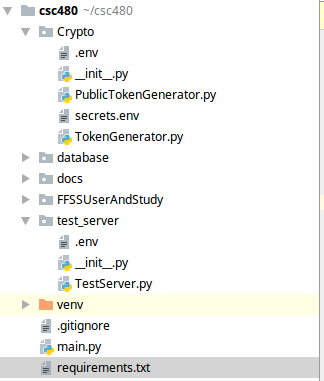

# buhtan-no-5 
## Getting Started
Team Engine is building the back end with Python >3.5 and Flask-Restful.

First ensure that all of the required packages are installed.
```
python3 -m pip install -r requirements.txt  
```
Next ensure that the .env file is located both in the Crpyto Folder and test_server folder. This is essential
for any of the encryption and decryption operations.Refer to the image below.



[//]: # (### A valid markdown comment but it appears to be only one line)

## Database
[//]: # (### A valid markdown comment but it appears to be only one line)

## Database
Database of use is MongoDB Atlas. This is a NoSQL database which is secured by TLS/SSL authentication. Using pymongo Engine and Database will be able to connect using the MongoClient mondule. To connect to the Database copy and paste the function below.
```
def connector():
    env_path = os.path.abspath(os.path.dirname(__file__))
    location = os.path.join(env_path, '.env')
    load_dotenv(dotenv_path=location)
    client = MongoClient(os.getenv('MongoURL'))
    db = client["StudyStore"]
    return db
```
Then change the "Mongo URL" placeholder with the connection string located in the env file.


## Deployment
### Flask And Gunicorn
Engine has decided to utilize gunicorn to create workers in order to handle requests. 
For Unix systems with venv installed.In order to run the local flask instance execute the below commands.
1.)You must change the address in the main() to your localhost
```
app.run(host='129.3.20.26', port=12100,debug=true)
app.run(host='0.0.0.0', port=12100,debug=true)
```
2.) Then you will be able to the launch the flask instance.
```
source venv/bin/activate
python3 main.py
```
In order to deploy the instance utilizing gunicorn, run the below command.The system which the flask server is running did not allow for gunicorn to be installed in accordance with permission isuses.The following command is what is utilized in order to ensure the server's persistence across sessions.
The first block represents running the flask instance locally.Ensure the port given to the Flask app and the gunicorn instance match.
```
 python3 launcher.py --bind 0.0.0.0:12100 launcher:app
```
In order to run the server as a background process,  the following is the generic format:
```
nohup python3 launcher py --bind ip_address:port class:app_name & >/dev/null 2>&1 &
```
The second block is the current command utilized to run the Flask instance on Pi.We redirect the output to /dev/null.
```
nohup python3 launcher.py --bind 129.3.20.26:12100 launcher:app  >/dev/null 2>&1 &
```
The third block is to run the production server using a self-signed cert. Ensure that you type https://pi.cs.oswego.edu.
```
python3 launcher.py --certfile cert.pem --keyfile key.pem --bind 129.3.20.26:12101 launcher:app

```
### Redis
Engine is utilizing Redis for three purposes. The first is to store recently accessed F5 studies in order to reduce latency.Second is to perform word recommendations based off of partial word searches from a user utilizing Redis' sorted sets and hash sets.The third is as a task queue to reduce the latency of the main application and to improve word recommendations.
The default Redis config was used as a baseline and modified for the needs of the LRU cache.

The port flag isnt required if the port is specified in the config file. Located in suggestions/ is the redis.conf which is utilized for the project. The database file or the corpus file  utilized for the recommendation instance is not store within the repo due to its size. 
```
./redis-server --port 6378  \path\to\config
./redis-server --port 6379  \path\to\config
./redis-server --port 6380  \path\to\config
```

## Documentation
This project will use Sphinx to create local documentation to aide others.There will be a readthedocs in the future.
* [CheatSheet](https://github.com/adam-p/markdown-here/wiki/Markdown-Cheatsheet) is a great resourse to utilize in order to improve the README.


## Built With
* [FLASK](https://pypi.org/project/Flask/) - Web Framework used
* [FLASK-RESTFUL](https://flask-restful.readthedocs.io/en/latest/) - RESTFul Framework
* [Gunicorn](https://gunicorn.org/) -Python Web Server Gateway Interface (WSGI)
* [Sphinx](https://www.sphinx-doc.org/en/master/) Tool used to build Documentation

## Authors

* **msglarson** - *Cool Americans* 
* **besoir** - *TREX*
* **jbald98** - *UML Wizard*
* **nahyromolina** - *Dancer*
* **bgroman** - **
